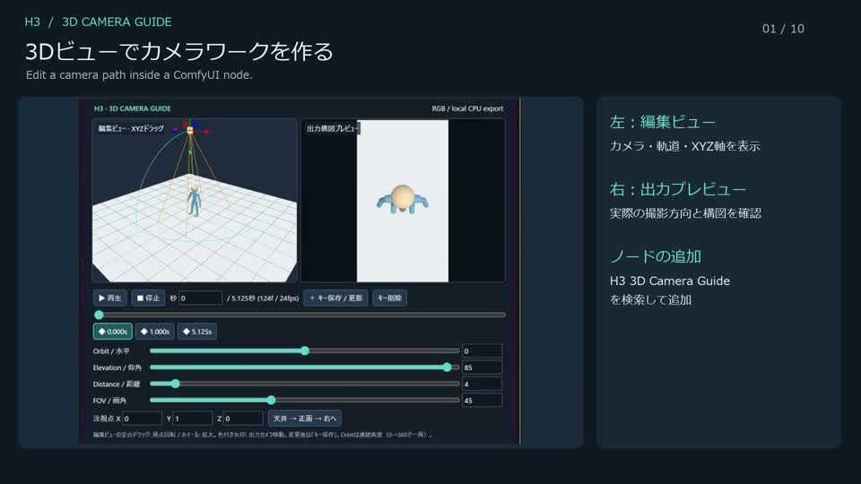

# H3 3D Camera Guide for ComfyUI

**日本語:** ノード内の3Dビューでカメラを動かし、キーフレームから簡易人型のRGBガイド動画を作る、ローカル完結のComfyUIカスタムノードです。軌道からカメラ専用プロンプトも生成し、MiniMax H3 Ref2VAへ文章のみ、または文章＋参照動画で接続できます。

**English:** A local ComfyUI custom node for editing camera motion in an embedded 3D view and rendering RGB guide videos of a simple mannequin from keyframes. It also compiles camera-only prompts from the trajectory for MiniMax H3 Ref2VA, with or without guide-video conditioning.

## 使い方動画 / Tutorial

[](docs/media/camera-guide-tutorial.mp4)

**[▶ 動画を開く・ダウンロード / Watch or download (67 s)](docs/media/camera-guide-tutorial.mp4)**

**日本語:** 実際のComfyUI操作を拡大表示し、日本語字幕と英語の補助説明で紹介します。最後に、カメラガイドを左、草原とカフェの既存生成例を右に並べます。カフェ例は**今回統合した投影方向ルールによる文章のみの既存検証結果**です。同一映像の再現を保証する例ではありません。[収録内容・生成条件・メディアの権利](docs/media/README.md)を参照してください。

**English:** Actual ComfyUI operations with zooms, Japanese captions and supporting English text, followed by side-by-side guide and generated examples in grassland and a cafe. The cafe clip is an **existing text-only experiment using the projected-direction rules now integrated into the node**, not a guarantee of identical output. See [contents, conditions and media rights](docs/media/README.md).

## 機能 / Features

| 日本語 | English |
|---|---|
| Three.js編集ビューと出力構図プレビュー | Three.js editor and output-camera framing preview |
| XYZドラッグ、Orbit・Elevation・Distance・FOV・注視点の調整 | XYZ dragging; orbit, elevation, distance, FOV and target controls |
| タイムライン、キー保存、再生、一時停止、停止、スクラブ | Timeline, keyframes, playback, pause, stop and scrubbing |
| workflowにカメラ軌道を保存・復元 | Camera state persists in saved workflows |
| 人型または球体と床のRGBフレーム列・VIDEO出力 | RGB frames and VIDEO with a mannequin or ball and floor |
| 既存動画の再利用、任意の床の色付き目印 | Reuse existing videos; optional colored floor landmarks |
| 編集用カメラ・軌道・グリッド・軸・UIは出力に含まない | Editor cameras, paths, grids, axes and UI are excluded from renders |
| 軌道を英文へ変換し、人物の動作文と合成 | Rule-based trajectory-to-text compilation and scene-prompt composition |
| Three.js同梱、実行時CDN不要、追加Pythonパッケージ不要 | Vendored Three.js; no runtime CDN or additional Python packages |

## 必要環境 / Requirements

**日本語:** ComfyUIの `comfy_api.latest.InputImpl.VideoFromComponents` と標準Save Videoを使用します。動作確認環境はWindows 11、ComfyUI 0.34.0、frontend 1.51.9、Python 3.13です。古いComfyUIや他OSでの動作は未検証です。ブラウザの3D表示にはWebGLが必要です。RGB出力はCPU処理で、ガイドノード自体にCUDA GPUやH3モデルは不要です。

**English:** Requires ComfyUI's `comfy_api.latest.InputImpl.VideoFromComponents` and standard Save Video node. Tested on Windows 11, ComfyUI 0.34.0, frontend 1.51.9 and Python 3.13. Older ComfyUI versions and other operating systems are untested. The browser editor requires WebGL. RGB rendering runs on the CPU; the guide node itself does not require a CUDA GPU or H3 model.

## インストール / Installation

1. **日本語:** このリポジトリをダウンロードし、フォルダを `ComfyUI/custom_nodes/h3-3D-camera-guide` に配置します。ZIPの場合は二重フォルダにならないようにしてください。
   **English:** Download this repository and place it at `ComfyUI/custom_nodes/h3-3D-camera-guide`. When extracting a ZIP, avoid an extra nested folder.
2. **日本語:** ComfyUIを再起動し、ブラウザを再読み込みします。
   **English:** Restart ComfyUI and reload its browser page.
3. **日本語:** ノード検索で **H3 3D Camera Guide** を追加するか、下記のサンプルを読み込みます。カテゴリは `H3/Camera Guide` です。
   **English:** Add **H3 3D Camera Guide** from node search or load a sample below. The category is `H3/Camera Guide`.

**日本語:** Gitを使う場合は `ComfyUI/custom_nodes` で次を実行してください。更新はインストール先のフォルダで `git pull` を実行後、ComfyUIを再起動しブラウザを再読み込みします。

**English:** With Git, run this inside `ComfyUI/custom_nodes`. To update, run `git pull` inside the installed repository, restart ComfyUI, and reload the browser.

```shell
git clone https://github.com/sepiablue-ai/h3-3D-camera-guide.git
```

**日本語:** `requirements.txt` は追加依存がないことを示すコメントのみです。通常利用でpipやnpmによるインストール、ビルドは不要です。

**English:** `requirements.txt` contains only a note that there are no extra dependencies. Normal use requires no pip/npm installation or build step.

## サンプルworkflow / Sample workflows

| ファイル / File | 用途 / Purpose |
|---|---|
| [camera_guide.json](workflows/camera_guide.json) | ガイド生成→保存の2ノード / Two nodes: render and save a guide |
| [camera_guide.api.json](workflows/camera_guide.api.json) | 同じ構成のAPI形式 / API-format equivalent |
| [minimax_h3_ref2va.json](workflows/minimax_h3_ref2va.json) | カメラ文章＋ガイド動画→H3 / Camera text plus guide video → H3 |
| [minimax_h3_camera_prompt_only.json](workflows/minimax_h3_camera_prompt_only.json) | カメラ文章のみ→H3（人物参照画像は使用） / Camera text only → H3 (identity pictures retained) |

**日本語:** 最初はガイド単体のworkflowを使ってください。H3統合版は追加ノードとモデルが必要なテンプレートです。3つのLoad Imageで、自分の同一人物の参照画像を選択してください。`reference_1.png`〜`reference_3.png` は差し替え用の名前で、画像は同梱しません。使用モデルと追加ノードは [H3接続説明](docs/H3_INTEGRATION.md) に記載しています。

**English:** Start with the guide-only workflow. The H3 workflow is a template requiring additional nodes and models. Select your own reference images of the same character in its three Load Image nodes. `reference_1.png` through `reference_3.png` are placeholder filenames; images are not included. See [H3 integration](docs/H3_INTEGRATION.md) for required nodes and model filenames.

## 操作 / Controls

1. **日本語:** 左が編集ビュー、右が出力カメラのプレビューです。左の空白ドラッグで編集視点を回転し、ホイールで拡大縮小します。
   **English:** The left view is the editor; the right shows output-camera framing. Drag empty space to orbit the editor view; use the wheel to zoom.
2. **日本語:** カメラのXYZ矢印をドラッグするか、各数値を調整します。編集視点を動かすだけでは出力カメラは変わりません。
   **English:** Drag the camera's XYZ arrows or adjust its values. Moving the editor view alone does not change the output camera.
3. **日本語:** 時刻を選び、カメラを配置して **キー保存 / 更新** を押します。同時刻のキーは上書き、新時刻なら追加します。未保存の変更は動画へ反映されません。
   **English:** Select a time, position the camera, and click **キー保存 / 更新** (save/update key). This updates an existing key or adds a new one. Unsaved edits do not affect the rendered video.
4. **日本語:** 再生・停止・タイムラインで動きを確認します。**天井 → 正面 → 右へ** は初期プリセットです。UIのボタン名は現在日本語です。
   **English:** Preview motion with playback, stop and the timeline. **天井 → 正面 → 右へ** resets the overhead-to-front-to-side preset. Editor button labels are currently Japanese.
5. **日本語:** ComfyUIのworkflowを保存すると、軌道も保存されます。iframe内で操作した後はノードタイトルをクリックし、`Ctrl+S` を押します。
   **English:** Saving the ComfyUI workflow also saves the trajectory. After interacting inside the iframe, click the node title before pressing `Ctrl+S`.
6. **日本語:** ComfyUIの実行ボタンを押すと、保存済みキーからRGB動画を生成します。
   **English:** Run the workflow to render RGB video from the saved keys.

## 形状・再利用 / Shape and reuse

| 入力 / Input | 操作 / Behavior |
|---|---|
| `subject_shape` | `mannequin` = 人型 / mannequin、`ball` = 球体 / ball |
| `floor_cues` | `plain` = 無地 / plain、`markers` = 床の4色の小さな目印 / four colored floor inlays |
| `source_mode` | `render` = キーから生成 / render keys、`reuse_video` = 既存動画を読み込む / load an existing video |
| `video_path` | 再利用するローカル動画の絶対パス、またはComfyUIの注釈付きファイル名 / Absolute local path or ComfyUI annotated filename |
| `existing_video` | 任意のVIDEO入力。接続時はvideo_pathより優先 / Optional VIDEO socket; takes precedence over video_path |

**日本語:** 一度Save Videoで保存したガイドのパスを `video_path` へ設定し、`source_mode = reuse_video` にすると、以後はCPU描画を省いて同じ動画をH3へ渡せます。再利用時はキー・形状・width/height/frames/fpsの設定を使わず、元動画の寸法・フレーム数・fpsを保持します。H3側は自動変更しません。24fpsの動画を選び、寸法と長さをH3側に合わせてください。誤表示を避けるため再利用時は3Dプレビューを隠します。ファイルが無い場合はエラーになり、勝手に再生成しません。

**English:** Save a guide once, enter its path in `video_path`, then choose `source_mode = reuse_video` to skip CPU rendering on subsequent H3 runs. Reuse ignores keys, shape and width/height/frames/fps widgets, preserving the source video's dimensions, frame count and fps. It does not update H3 settings automatically. Select a 24 fps clip and match H3 dimensions and length. The editor preview is hidden in reuse mode to avoid showing an unrelated trajectory. A missing file raises an error without silently rerendering.

**日本語:** 球体は「立つ／座る」の姿勢競合を減らすための選択肢ですが、回転対称なので球だけでは周回方向を読み取りにくくなります。`markers` は向きの手掛かりとなる床の実物模様で、出力動画にも映ります。編集用グリッドやXYZ軸は出力しません。

**English:** A ball removes the standing-versus-sitting pose cue, but its rotational symmetry makes orbit direction harder to infer. `markers` adds physical floor patterns as orientation cues; these appear in the output. Editor grids and XYZ axes remain excluded.

## 出力と接続 / Outputs and connections

### カメラ専用プロンプト / Camera-only prompt

`H3 Camera Prompt / カメラ専用プロンプト` は保存された全キーフレーム区間をCPUのルールで英文に変換します。LLM・外部API・追加モデルは不要です。特定のプリセット判定は使いません。

The prompt node compiles every saved trajectory interval on the CPU, without an LLM, external API or extra model. It does not match a fixed set of camera presets.


**日本語:** 画面の上下左右をカメラのright/up軸への投影で求め、俯瞰でも「顔側が画面下」、側面なら「鼻先が画面左」など、画像上の構図として記述します。基準はエディターの+Z正面です。人物を振り向かせる命令ではなく、人物が独自に回転するとこの基準との対応が変わります。大きな周回は実際の補間軌道上に説明用の中間点を設け、全周回を省略しません。文章用の時点が80を超える軌道は、黙って省略せずエラーにします。

**English:** Image directions are projected onto the camera's right/up axes. Even overhead views retain an image-front cue, such as the facial side toward the bottom; a side view can describe the nose toward the left image edge. The editor's +Z front is the orientation anchor, not an instruction to turn the actor. Independent actor rotation can break that correspondence. Large orbits add descriptive waypoints sampled from the actual interpolated path, preserving full turns. More than 80 descriptive times raises an explicit error rather than truncating the motion.

**日本語:** 既存のHard/cafe・seed42では開始方向が改善し、終了の左向き横顔を維持しました。中間2.5秒の角度ずれは残っています。統合後のカメラ文章が検証用実装と一致することを確認しましたが、今回のリリース作業ではH3の再生成は行っていません。

**English:** The existing Hard/cafe seed-42 test improved the opening direction and retained the left-facing ending profile; the angle at 2.5 seconds still differed. The integrated camera text was checked against the experimental implementation. No additional H3 generation was performed for this integration.

- `camera_json` → 合成ノード → `combined_prompt` → Ref2VAのprompt。既存の `rgb_frames` → Ref2VA参照動画の接続も維持。 / Connect camera JSON to the composer and its combined prompt to Ref2VA; retain the existing guide-frame connection.
- `scene_prompt` は人物の動作・服装・場面、`identity_prompt` は参照画像と人物の対応。入力文は保持し、カメラ生成文には人物の姿勢・視線・手足の動きを追加しません。 / Scene text controls actions, clothing and setting; identity text defines picture references. User text is preserved; generated camera text adds no body, gaze or limb actions.
- `use_reference_video=true` は動画参照あり。falseで比較する場合はH3側の動画参照入力も外してください。このスイッチ単独では配線は変更しません。 / Set true when the video is connected. For a text-only camera comparison, set false AND remove the H3 video-reference input; the switch does not rewire the graph.
- 周回の方向と複数回転、上下の弧、接近・後退、FOVによるズーム、注視点とカメラの平行移動、同時変化、停止、反転を各区間の時刻で記述。時間とfpsはガイド出力が正本です。 / Covers signed and multiple orbits, elevation arcs, dolly, FOV zoom, aim/rig translation, combined changes, holds and reversals, with timing taken from the guide output.
- 通常のSave Videoで保存したガイドは、`video_path`から再利用する際に一致する保存メタデータがあれば軌道を復元します。編集・リネーム・メタデータ削除済みの動画や外部VIDEO入力など、軌道が確認できない場合はプロンプト生成だけがエラーになります。動画再利用自体は残っています。 / Matching native Save Video metadata can restore a reused guide's trajectory via video_path. Unknown, renamed or metadata-stripped clips and external VIDEO sockets are not motion-estimated; prompt compilation fails clearly while ordinary video reuse remains available.

**制約 / Limits:** 汎用性は現在の3D UIが表現できる軌道に対するものです。ロール・カットなどUIに存在しない自由度は生成しません。一般的なカメラ指示の競合はエラーにしますが、任意の自然言語の意味を完全に判定する仕組みではありません。英文のカメラ指定はH3への指示であり、幾何学的な拘束や追従保証ではありません。

Generality covers the trajectories representable by this editor; unsupported roll or cuts are not invented. Common camera-text conflicts raise an error, but semantic conflict detection is heuristic. Camera language instructs H3; it is not a geometric constraint or a guarantee of adherence.

| 出力 / Output | 型 / Type | 用途 / Use |
|---|---|---|
| `rgb_frames` | IMAGE | H3の参照動画入力、画像プリプロセッサ / H3 reference-video input or image preprocessors |
| `video` | VIDEO | 標準Save Videoへ接続 / Connect to standard Save Video |
| `fps` | FLOAT | フレームレート / Frame rate |
| `camera_json` | STRING | キー・フレーム数・fps。再利用時は確認できた元の軌道も含む / Keys, frame count and fps; verified source trajectory when reusing |

**日本語:** H3へは `rgb_frames` → `ref_videos.ref_video_0` を接続し、ガイドを **24fps** にします。統合workflowの「RGB Camera Guide」は確認用動画を保存するSave Videoです。その出力が未接続でも正常です。H3へは3Dカメラノードから直接フレーム列を渡しています。

**English:** Connect `rgb_frames` to H3's `ref_videos.ref_video_0` and use **24 fps**. The integrated workflow's “RGB Camera Guide” node is a Save Video node for the guide preview. Its output may remain unconnected; H3 receives frames directly from the 3D camera node.

**日本語:** 現行のH3テンプレートは合成ノードが時刻・角度・移動方向を軌道から自動生成します。人物・画風・動作は `scene_prompt` と `identity_prompt` に記述し、同じ欄にカメラ指示を重ねないでください。文章のみのテンプレートでも現在はガイドノードのRGB処理を実行して `camera_json` を取得します。「H3へ動画を入力しない」と「ガイドを描画しない」は別です。

**English:** The current H3 templates use the composer to derive times, angles and movement directions from the trajectory. Put character, style and action instructions in `scene_prompt` and `identity_prompt`; avoid competing camera instructions in those fields. The text-only template currently still executes the guide node's RGB processing to obtain camera JSON. Omitting video conditioning from H3 does not eliminate guide rendering.

## 仕様と制限 / Behavior and limitations

| 日本語 | English |
|---|---|
| Y上、+Z正面。Orbit 0°は正面、+90°は+X側 | Y up, +Z front. Orbit 0° is front; +90° moves to the +X side |
| 注視点を中心に球面座標で移動。独立rollなし | Spherical motion around a target; no independent roll |
| smoothstep補間。各キーで速度が0になる | Smoothstep interpolation, with zero velocity at each key |
| 連続角度。350→370は20°、350→10は逆方向340° | Unwrapped angles: 350→370 is +20°; 350→10 is −340° |
| 124f/24fpsは約5.167秒、最終フレーム時刻は5.125秒 | 124 frames at 24 fps last about 5.167 s; last frame timestamp is 5.125 s |
| キーは1〜200個、時刻0〜120秒。範囲外のキーは出力に到達しない | 1–200 keys at 0–120 s. Keys beyond the output duration are not reached |
| fps・frames変更時はキー時刻も確認。自動フレーミングなし | Check key times after changing fps/frame count. No automatic framing |
| プレビューと出力は同じ形状・カメラ式。照明・色・AAは異なる | Preview and render share geometry/camera math; lighting, color and AA differ |
| CPUレンダラーはRAMと時間を使用。1.8億画素上限、RGBテンソルだけで最大約2.16GB | CPU rendering takes time and RAM. Limit: 180 million pixels, up to ~2.16 GB for the RGB tensor alone |
| 人型は固定ポーズ。Depth / Edge / Pose専用出力は未実装 | Mannequin has a fixed pose. Dedicated depth/edge/pose outputs are not implemented |
| 本リポジトリはRGB Ref2VA用。ControlNet連携なし | This repository targets RGB Ref2VA; no ControlNet integration |
| Ref2VAはガイドへの厳密な追従を保証しない | Ref2VA does not guarantee exact trajectory following |

## 検証状況 / Validation status

現在は20テスト（カメラ式、全区間のプロンプト生成、動画メタデータ復元、動作文の保持等）と配布ファイル検査を通過。従来の3D UI操作・保存復元確認に加え、新しい合成ノードの入力表示と配線を確認しています。

Twenty tests cover camera math, trajectory compilation, saved-video metadata recovery and action-text preservation; release checks pass. Existing 3D editing/save-reload checks are supplemented by the new composer's input and wiring checks.

カフェで座って飲む場面を、同じseed・参照画像でカメラ文のみ／カメラ文＋動画の各1本生成しました。どちらも俯瞰→正面→横の順序と着座した飲む動作が出ましたが、指定の1秒での正面到達は未達です。一般的な動画参照の優劣は未確定です。条件・旧検証との区別は [H3接続と比較](docs/H3_INTEGRATION.md) を参照してください。

One seated-coffee clip per mode used the same seed and identity references. Both camera-text-only and camera-text-plus-video produced overhead/front/side views with seated drinking, but missed the one-second frontal arrival. No general winner is established. See [H3 integration and comparisons](docs/H3_INTEGRATION.md). Personal reference images and raw logs are excluded. Only the explicitly published tutorial includes selected generated examples; see its conditions above.

## フォルダ構成 / Repository layout

```text
h3-3D-camera-guide/
├── __init__.py, nodes.py, camera.py, camera_prompt.py, renderer.py  # Python runtime
├── web/                                         # Editor and vendored Three.js
├── workflows/                                   # Public example workflows
├── tests/                                       # Camera/render tests
├── tools/                                       # Optional developer tools
├── docs/H3_INTEGRATION.md                        # H3 setup (JA / EN)
├── docs/media/                                  # Tutorial MP4, preview and media notes
├── LICENSE                                      # Project MIT license
├── THIRD_PARTY_NOTICES.md                        # Third-party notices (JA / EN)
└── README.md
```

**日本語:** 手元の `validation/` と直下の `MiniMax_H3_3D_Camera_Guide.json` は個人用としてGit対象外です。公開用H3テンプレートは `workflows/` にあります。通常利用に `tests/` と `tools/` は不要です。

**English:** Local `validation/` and the root-level `MiniMax_H3_3D_Camera_Guide.json` are excluded from Git as private working files. The public H3 template lives in `workflows/`. `tests/` and `tools/` are not required at runtime.

## 開発 / Development

**日本語:** リポジトリ直下でComfyUIのPythonを使ってテストします。JS/Python一致テストにはNode.jsが必要です。`check_release.py` は配布ファイル、ローカルリンク、workflow接続、同梱ハッシュを確認します。H3生成は実行しません。

**English:** Run tests from the repository root using ComfyUI's Python. Node.js is needed for the JS/Python parity test. `check_release.py` checks release files, local documentation links, workflow connections and vendor hashes. It does not run H3 generation.

```powershell
python -s tests/test_camera.py
python -s tests/test_camera_prompt.py
python -s tools/check_release.py
```

**日本語:** Windows開発用ジャンクションは、ComfyUIフォルダを明示して作成できます。既存の登録先は上書きしません。

**English:** For Windows development, create a junction by explicitly specifying the ComfyUI folder. Existing destinations are not overwritten.

```powershell
powershell -NoProfile -ExecutionPolicy Bypass -File tools/install.ps1 -ComfyRoot 'D:\ComfyUI_windows_portable\ComfyUI'
```

**日本語:** `tools/fetch_vendor.py` はThree.js r169を上流から再取得する開発専用ツールで、ネット接続が必要です。通常利用では実行しません。

**English:** `tools/fetch_vendor.py` is a development-only tool for fetching Three.js r169 from upstream and requires network access. Do not run it for normal installation.

## ライセンス / License

**日本語:** 本体の独自コード・ドキュメント・独自workflow構成は [MIT](LICENSE)。Three.jsの著作権表示・MIT原文は [別途保持](web/vendor/THREE-LICENSE.txt) しています。モデルや参照画像、生成物を本体のMITで一括許諾するものではありません。公開デモ動画と画像はMIT対象外で、[メディアの権利](docs/media/README.md)を別記しています。詳細は [第三者の権利表示](THIRD_PARTY_NOTICES.md) を参照してください。

**English:** Original project code, documentation and workflow configuration are licensed under [MIT](LICENSE). Three.js retains its [own copyright notice and MIT text](web/vendor/THREE-LICENSE.txt). This does not license model weights, reference assets or generated media collectively under the project's MIT license. Published demo media are excluded from MIT; see [media rights](docs/media/README.md) and [third-party notices](THIRD_PARTY_NOTICES.md).
